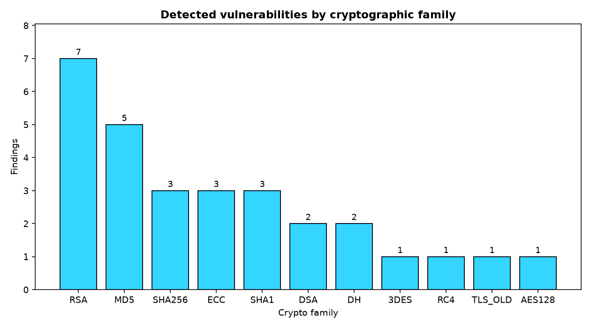
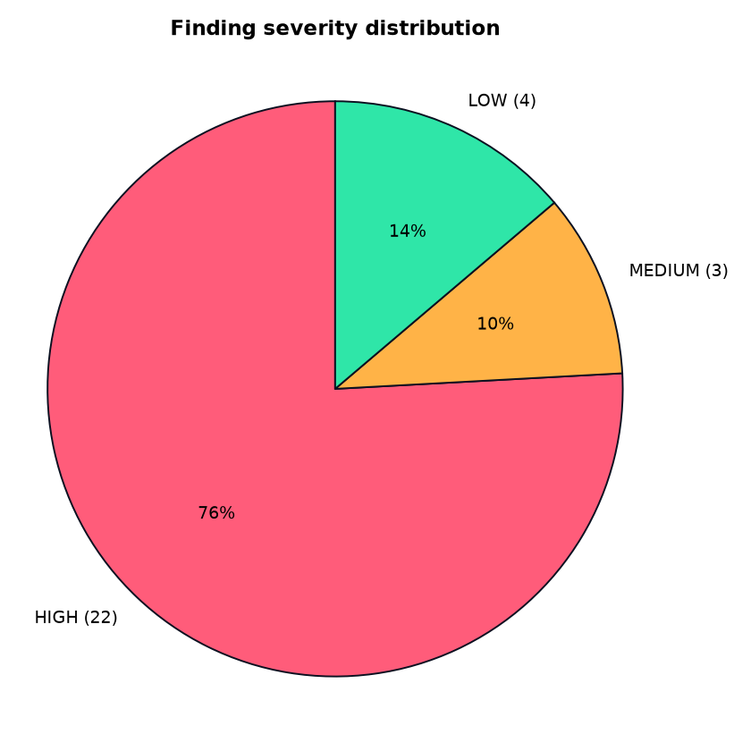
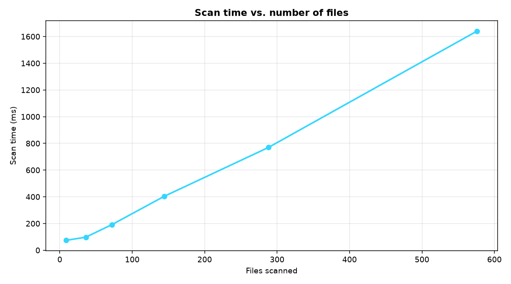

# Benchmark graphs

Figures generated from **live scanner output** by
[`generate_graphs.py`](generate_graphs.py) — the script runs the real scanner over
the labeled corpus and over size-scaled copies of it, so nothing here is
hardcoded.

```bash
pip install matplotlib        # optional — not a core/CI dependency
python benchmark/graphs/generate_graphs.py
```

| File | Chart | Source data |
|------|-------|-------------|
| `vulnerabilities_by_type.png` | Bar: detected findings per crypto family | live scan of `benchmark/positive/` |
| `severity_distribution.png`   | Pie: HIGH / MEDIUM / LOW share | live scan of `benchmark/positive/` |
| `scan_time_vs_size.png`       | Line: scan time vs. number of files | timed scans of scaled corpora |





> The bar/pie counts are **raw scanner findings** (per matched line), so the total
> can exceed the 24 labeled `(file, family)` pairs reported in
> [../RESULTS.md](../RESULTS.md) — both are correct, they just count at different
> granularity. The line chart's timings depend on your host.
