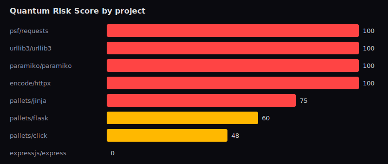

# Empirical study: quantum-vulnerable cryptography in popular open source

*Generated 2026-06-28T21:47:56.804483+00:00 by `study/run_study.py` — reproducible.*

## Method

Each project was shallow-cloned and scanned with the QuantumSafe engine (the same code path as `quantumsafe scan --repo`). Findings are aggregated below. **Caveats (stated honestly):** this is static analysis over whole repositories *including test code and vendored files*; cryptography libraries naturally reference many algorithm names, so a high count is expected for them and does not imply they are insecure.

## Headline findings

- **8** popular projects scanned.
- **88%** contain at least one quantum-relevant cryptographic usage.
- **88%** contain at least one **HIGH-risk** (Shor-breakable: RSA/ECC/DSA/DH or MD5/SHA-1) usage.
- Average Quantum Risk Score: **72.9/100**.

## Per-project results

| Project | Score | Band | HIGH | MED | LOW | Top algorithms |
|---------|------:|------|-----:|----:|----:|----------------|
| psf/requests | 100 | Critical | 7 | 0 | 3 | md5×5, sha256×3, sha1×2 |
| urllib3/urllib3 | 100 | Critical | 10 | 67 | 12 | tls_old×67, tls12×11, md5×7, sha1×2, sha256×1 |
| paramiko/paramiko | 100 | Critical | 393 | 9 | 49 | rsa×194, ecc×125, sha256×37, sha1×28, md5×25 |
| encode/httpx | 100 | Critical | 11 | 0 | 9 | sha256×9, md5×8, sha1×3 |
| pallets/jinja | 75 | High | 5 | 0 | 0 | sha1×5 |
| pallets/flask | 60 | Medium | 4 | 0 | 0 | sha1×4 |
| pallets/click | 48 | Medium | 3 | 0 | 3 | sha256×3, sha1×2, md5×1 |
| expressjs/express | 0 | Low | 0 | 0 | 0 | — |

## Most common quantum-vulnerable families

| Family | Occurrences |
|--------|------------:|
| rsa | 194 |
| ecc | 125 |
| tls_old | 67 |
| sha256 | 53 |
| md5 | 46 |
| sha1 | 46 |
| tls12 | 11 |

## Takeaway

Quantum-vulnerable cryptography is pervasive even in well-maintained, widely-depended-on projects — which is exactly why automated detection and a migration plan (what QuantumSafe provides) are useful as the post-quantum transition begins.
